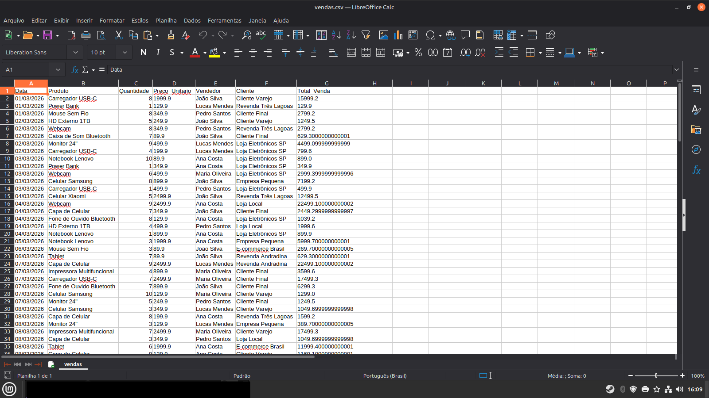
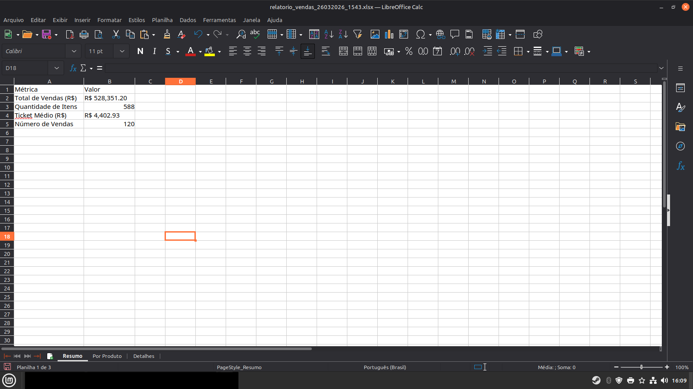
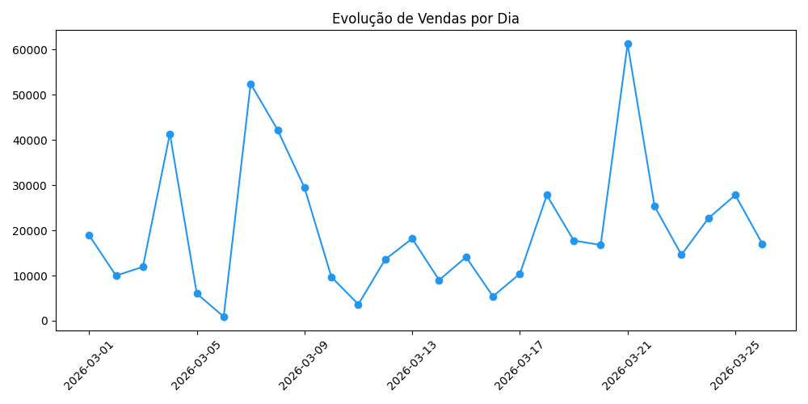
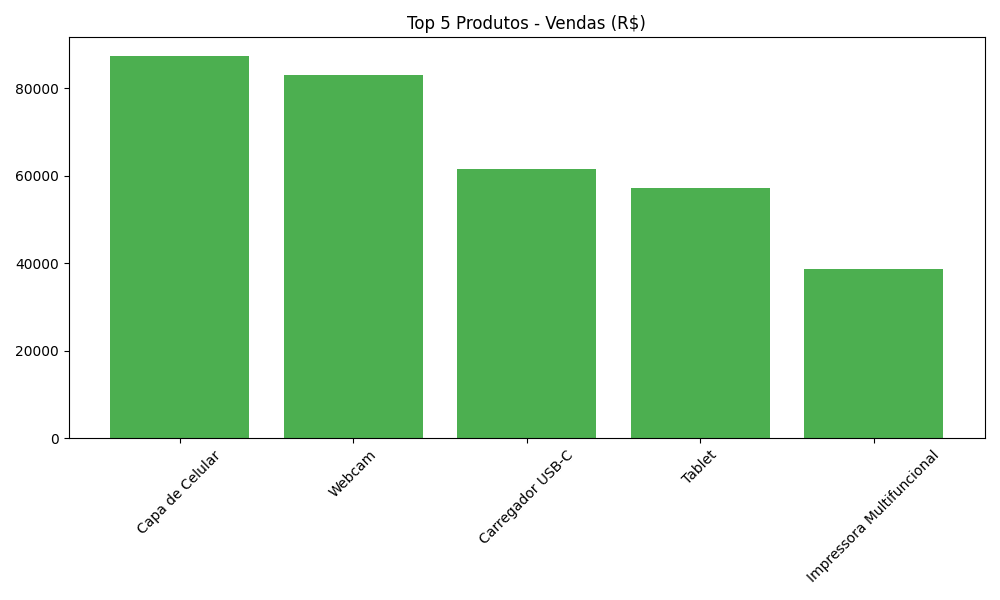
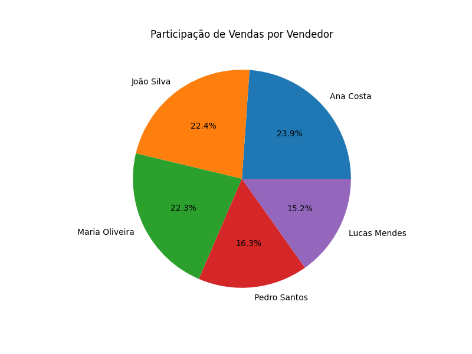

# Automação de Planilhas de Vendas com Python

**Economize horas todo mês processando suas vendas automaticamente.**

Este script lê uma planilha de vendas (Excel ou CSV), calcula totais, médias, filtra por período/produto e gera um relatório bonito automaticamente.

### Problema que resolve
Lojistas e contadores perdem muito tempo somando colunas, criando gráficos e enviando relatórios. Esse script faz tudo em segundos.

### Funcionalidades
- Lê arquivo Excel/CSV
- Calcula totais por produto, vendedor e período
- Gera relatório formatado com gráficos
- Salva novo arquivo Excel pronto pra usar

### Tecnologias
- Python 3
- pandas
- openpyxl
- matplotlib (para gráficos)

### Como usar
1. `pip install pandas openpyxl matplotlib`
2. Coloque sua planilha `vendas.xlsx` na pasta
3. `python main.py`
4. Pronto! O relatório será gerado.

### Prints

#### Planilha enviada pelo cliente

#### Resultados

### Quer uma versão personalizada para o seu negócio?
Entre em contato: WhatsApp (18)99614-5924 ou pelo 99Freelas https://www.99freelas.com.br/user/albertoribeiroalfredo